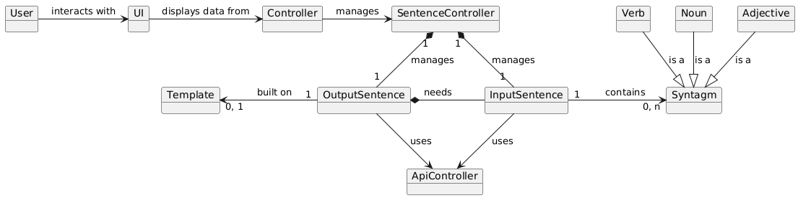

*Gruppo 63616E617A7A61, Elementi di ingegneria del Software*.

# *Domain model*

# *Class diagram*

## Descrizione del sistema:
+ **ApiController:**
Utility Class che si occupa di interfacciarsi direttamente con la Google cloud API a cui effettua
richieste in base alle istruzioni ricevute dalle classi InputSentence e OutputSentence.
Fornsice funzionalità riguardanti l'estrazione e categorizzazione dei sintagmi di una frase, la creazione di alberi sintattici, la tossicità della frase e il salvataggio nel cloud bucket delle frasi generate.

+ **DataUtils**:
Utility Class usata nell'inizializzazione delle liste di verbi, nomi e aggettivi che formano il
dizionario interno del sistema. DataUtils fornisce inoltre metodi che implementano il salvataggio
di termini nel dizionario interno e su file.

+ **Template:**
Classe usata per gestire i vari template usati nella costruzione della frase generata. La classe
fa uso di funzionalità fornite da DataUtils per gestire una lista interna di templates caricata da file di testo.
Un ***Template*** contiene un campo interno in cui vengono salvate delle frasi costruite in modo tale da avere verbi, nomi e aggettivi rimossi e sostituiti con %v, %n, %v rispettivamente.

+ **SentenceController:**
Classe che gestisce le interazioni tra InputSentence e OutputSentence in base alle istruzioni ricevute dall'UI layer.

+ **InputSentence:**
Classe usata nella gestione della frase fornita dall'utente tramite interazioni con la classe ApiController. Durante l'inizializzazione la frase fornita dall'utente viene salvata in un campo value.  
Il metodo privato ***extract()*** viene eseguito durante l'inizializzazione dell'oggetto InputSentence e delega ad ApiController l'operazione necessaria a riconoscere i vari sintagmi componenti la frase fornita e categorizzarli come Verb, Noun e Adjective.
Il metodo ***getSyntaxTree()*** viene usato per ottenere l'albero sintattico della frase fornita.

+ **OutputSentence:**
Classe che gestisce la generazione di una frase casuale basandosi su un oggetto di tipo ***InputSentence***. 
***OutputSentence*** tramite il metodo privato ***generate()*** usa le funzionalità della classe ***InputSentence*** per suddividerne i sintagmi, successivamente fa uso di un oggetto ***Template*** (casuale o fornito) che riempie usando i termini estratti e termini aggiuntivi se questi non sono sufficienti. 

# **Sequence diagrams**
## System sequence Diagram

## Internal sequence diagrams
+ ### **Inizializzazione tramite DataUtils**
 

+ ### **InputSentence**

 

+ ### **OutputSentence**
 

+ ### **SentenceController**
 