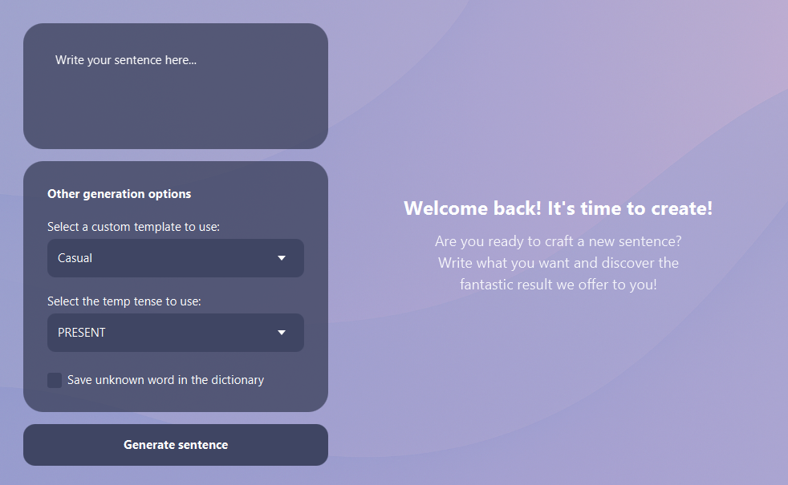
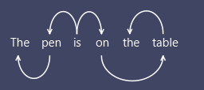

*Gruppo 63616E617A7A61, Ingegneria del Software (B)*

 

## NonSenseGenerator User Manual

### Index:
+ [Project Description](#project-description)
+ [How to run the program](#how-to-run-the-program)
  + [Execution constraints](#how-to-run-the-program)
+ [Libraries used and external APIs](#technologies-used)
+ [Main functions of external libraries](#main-functions-used-by-libraries)
 
 
 

# Project Description 

NonSenseGenerator is a random sentence generator. Starting from a textual input provided by the user, the program generates random sentences following an internal linguistic processing logic. 

 

## Main features provided to the user

In the interface we find in order: a text field where it is possible to write the input sentence, then a drop-down menu that allows you to choose the structure that the generated sentence must have and a menu for selecting the verb tense that must be used in the output sentence, in the end a checkbox that allows you to save in the internal dictionary the unknown terms present in the input sentence.

### Sentence generation
The generation process is based on three phases:
- Selection of a **template**: The structure for the sentence to be generated is selected by the user or randomly.
- Lexical **extraction**: Nouns, adjectives and verbs are extracted from the input through grammatical analysis.
- Sentence **composition**: The extracted elements are inserted into the corresponding fields of the template. If a category (nouns, verbs, adjectives) does not contain enough elements, the system integrates random words taken from a local lexical dataset.

### Toxicity analysis
The sentence generated by the algorithm is subjected to a toxicity analysis, where toxicity means explicit, violent or vulgar content; more generally, all content deemed inappropriate will have a _toxicity rate_ higher than other sentences.

### Syntax tree view
The program also provides a deep analysis of the input sentence, providing the user with a syntax tree of the same.  
  
<i>The tree is represented in a "horizontal" direction for space reasons.</i>
 
 
 

## How to run the program
To launch the application:
1. **Clone or download** the project to your device
2. In the root directory of the project, insert the JSON file of the Google Cloud Console service account, renaming it to: <code>api_key.json</code>
3. Verify that you have **Maven** installed and properly configured on your system.
4. From the root of the project, run the following command to launch the application: <code>mvn javafx:run</code>
> ℹ️ Make sure you are using JDK 21 or later to ensure the program runs correctly

**How ​​to set up Google Cloud Console**
1. **Create a Service Account**
- Go to "IAM and Administration" > "Service Accounts"
- Click "+ CREATE SERVICE ACCOUNT"
- Enter name and description
- Assign the role "Storage Admin" (or at least "Storage Object Admin" for write permissions)
> ℹ️ *This is necessary to enable the use of buckets and therefore save all generated sentences to Google Cloud*
- Click "Done"
2. **Create a key for the Service Account**
- In the list of Service Accounts, click on your newly created one
- Go to the "KEYS" tab
- Click "ADD KEY" > "Create new key"
- Choose JSON format and download the file

 
 
 

## Technologies used 
The project uses several technologies to ensure efficient development and a well-functioning program:

**Language and development environment**
- **Java 21**: main programming language
- **Maven**: for managing dependencies in the project

**Graphical interface**
- **JavaFX (v23.0.1)**: used for creating the GUI

**Testing**
- **JUnit 5 (Jupiter v5.8.2)**: for writing and running automatic code tests

**Text processing**
- **Google Cloud Natural Language API**: for syntactic analysis, information extraction and toxicity assessment
- **Simple NLG**: for language generation, such as changing the tense of a verb
- **Evo Inflector**: library for managing the transition between the singular and plural form of a word

**Cloud services**
- **Google Cloud Storage API**: for saving sentences generated by the system. Each sentence is recorded in a log in json format.

**Other plugins**: Other plugins are also used such as _JavaFX Maven Plugin_ or _Maven Javadoc Plugin_

 
 
 

## Main functions used by libraries
The project uses several libraries to ensure the correct functioning of the program:

**Simple NLG**

The following methods are applied to the `SPhraseSpec` object which effectively represents a sentence, i.e. a wrapper of `PhraseElement`, this library is used in the project only and exclusively to correctly conjugate the verbs of the output sentence (if possible) by analyzing the person and number of the subject.
- `setVerb(Object verb)` adds the verb to our SPhraseSpec object
- `setFeature(String featureName, Object featureValue)` used in multiple variations, is used to add information about the sentence, in the program it is used to add person, number and tense to our verb, so that it is conjugated in the most correct form.

example: (assuming `sentence` object of class SPhraseSpec) 
`sentence.setVerb("was");` 
`sentence.setFeature(Feature.TENSE, Tense.PRESENT);` 
`System.out.println(realiser.realiseSentence(sentence));` 
the output we will see in the console will be <b>is</b>.

**Evo Inflector**

Provides methods for pluralizing names. This library was chosen because it was decided to introduce plural names within templates. So every time a plural name should be inserted, the program first checks that the name is pluralizable (i.e. that it is not a proper name), then if it is, it uses the following library to pluralize it; otherwise, the program discards the non-pluralizable name and chooses a pluralizable name from the dictionary.
- `English.plural(String word)` pluralizes word.
- `English.plural(String word, int count)` pluralizes the word or not based on the value of cont: <b>cont = 1</b> keeps the word singular; <b>cont = 2</b> pluralizes the word.

Pluralized terms are not always correct, in fact the developers of this library declare: *"Overall it returns a correct answer 69.02782% of the time"*.

**Google Cloud Natural Language API**

APIs used to analyze the syntactic part of a sentence and to validate some parameters related to the properties of the sentence, such as toxicity. In the project, calls were made to two Google Cloud Natural Language APIs, specifically:
- **Analyzing Syntax** the response to this API returns a collection of `Token` objects that contain valuable information for the operation of the program, among the most used functions: `token.getPartOfSpeech()` and `token.getDependencyEdge()`.
- **Moderate text** the response to this API returns a collection of `ClassificationCategory` objects that contain various moderation parameters of the sentence.

**Google Cloud Storage API**

Used for the management of `Buckets`, so as to save each time the sentence generated by the program. A Bucket is a particular object that can contain other objects the `Blob`s, each of these allows to manage and represent a resource, in the program we use the Blobs to load the sentences generated by the program in json format into the Bucket. The main method that allows this is:
- `create(BlobInfo blob, byte[] content)` that accepts a correctly initialized BlobInfo object (therefore already associated with a Bucket) and an array of bytes that will be the file we want to upload. This method is a method of the `Storage` class that takes care of authenticating to the Google Cloud Storage service.
